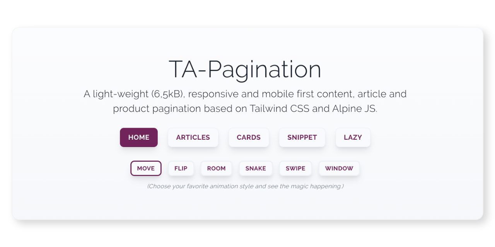

<p align="center">
  
</p>

# TA-Pagination

An content pagination solution which is 100% customizable and has endless animation options. If you already use Tailwind CSS and Alpine JS in your project you might consider using TA-Pagination. If you are aware of speed loading then you can use the lazy loading feature so you can keep you web page speed high.

Use TA-Pagination as a part of your Tailwind CSS and Alpine JS project. You can use it as a stand alone version but it works best together with your own scripts and enhancements. The content and article pagination is designed to fit in every project, in every grid and in every flexbox design.

## Demos and documentation

[DEMO](https://ta-pagination.markusantonwolf.com)
[REALWORLD](https://www.markusantonwolf.com/en/blog/vue-js)
For more details about the TA-Pagination take a look at <https://ta-pagination.markusantonwolf.com> and if you want to see a real world example you can find it on my homepage: <https://www.markusantonwolf.com/en/blog/vue-js>

## Features

- Lazy loading
- Balanced content item height base of CSS custom properties
- Customizable pagination - start element and amount of elements
- Customizable animations - CSS animations
- Customizable class names
- Small file sizes JS + CSS + Animation = 9,6 kByte
- Alpine JS and Tailwind CSS + BEM

## Local development

```
// To install dev dependencies run:

npm install

// To start the development server run and go to http://localhost:8888/:

npm run serve

// To make a development build run:

npm run develop

// To make a production build run:

npm run build
```

## Download

TA Pagination is released under the MIT license & supports modern environments.

## Copyright

© 2020 Markus A. Wolf
<https://www.markusantonwolf.com>
